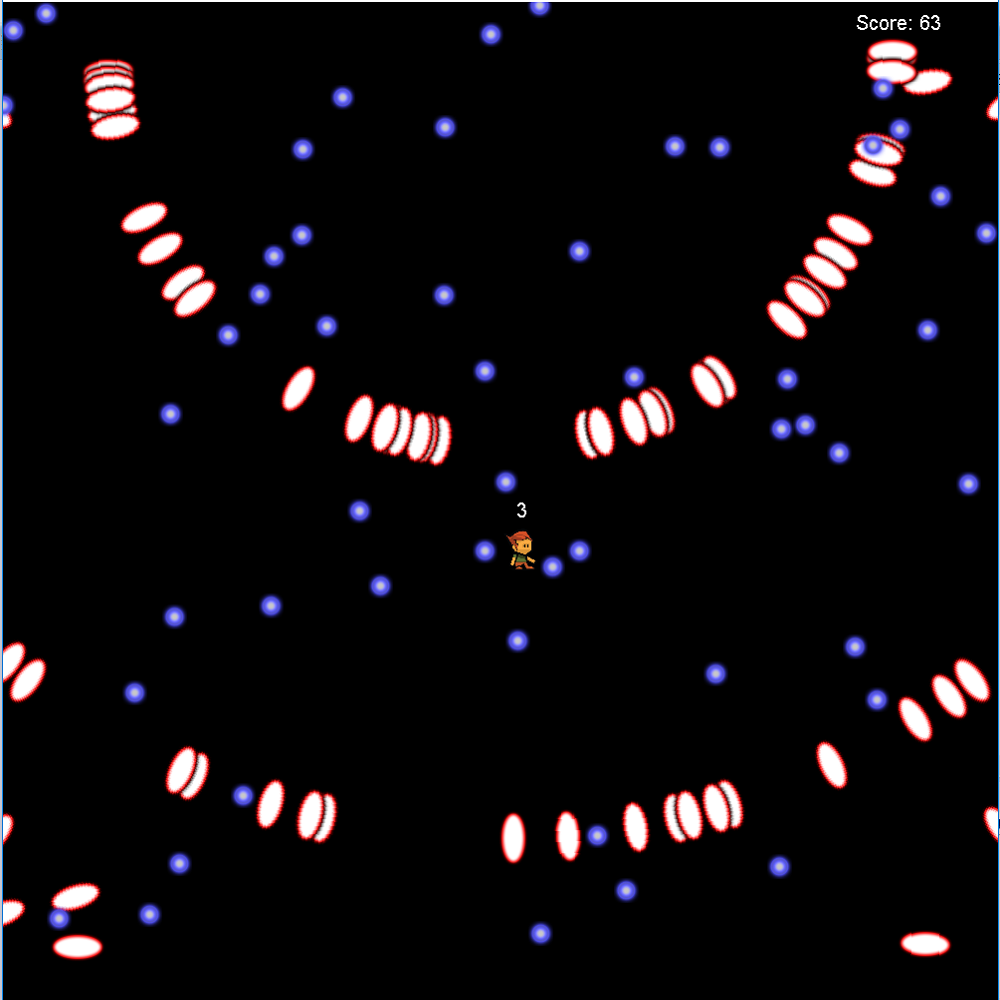

  

This is a simple game that uses Dylan Kobayashi's EZ framework in Java. The player controls a character on the screen and moves around with the WASD keys to avoid the moving bullets. There are three difficulties to choose from, that alter the amount of bullets on the screen. A score is tracked at the top-right of the screen which correlates to how long the player has no been hit by a bullet. The game ends the first time a player is hit.

For this project, I programmed the main logic for the bullets, such as where they spawn and their hitboxes. I also programmed the menu and the different difficulties for the game.

The source code for the project is on my [github here](https://github.com/clift3/ICS-111-Game).

