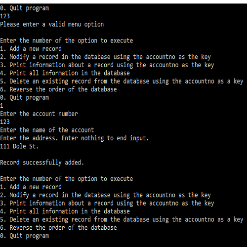

  

The database I created stored accounts that contained account numbers, names, and addresses. The accounts were stored in a linked list data structure. The user could add, delete, modify, and search accounts within the database. It was able to read a text file at start-up that contained the information of accounts previously inputted. When the program closed, the current accounts within the database are written to a text file.

The source code for the project is on my [github here](https://github.com/clift3/simple-database).

