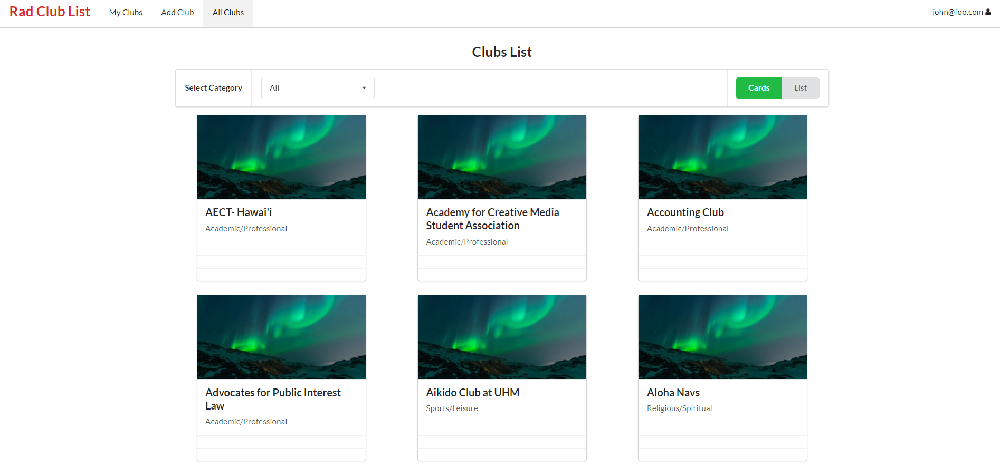

  

This project was done for ICS 314, Software Engineering. The main goal of the project was to provide a better method of exploring the clubs available at UH. At the time of the project, only a spreadsheet listing all the clubs with contact information was available. The features available were sorting the club by categories and adding/removing clubs from your own profile. Each club had their own club page with some information about the club.

For this project, we used Meteor with react to design the website. I worked on designing the individual club pages and the database. This included creating a collection to store a user's club data as well as the different sorting available on the user's end. 

  

My main takeaway from this project was learning to work in conjunction with others on the same project. This was a first for me, so getting a feel for the pacing and division of tasks was a fruitful experience. This was also by first dabble into web design and the backend portion of it all. It was also my first time using underscore in an actual project.
 
For more information about the project, you can visit the project page here: [rcl808.github.io](https://rcl808.github.io/).

The source code for the website can be found here: [github](https://github.com/rcl808/rcl808).

